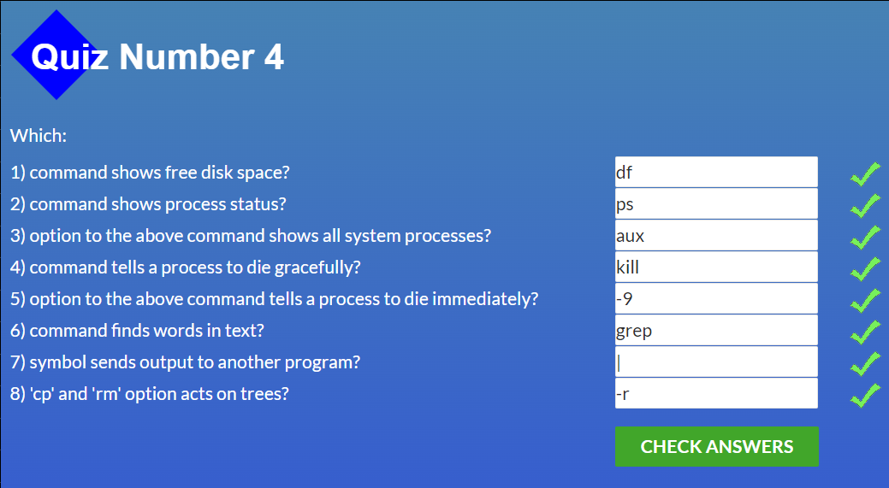
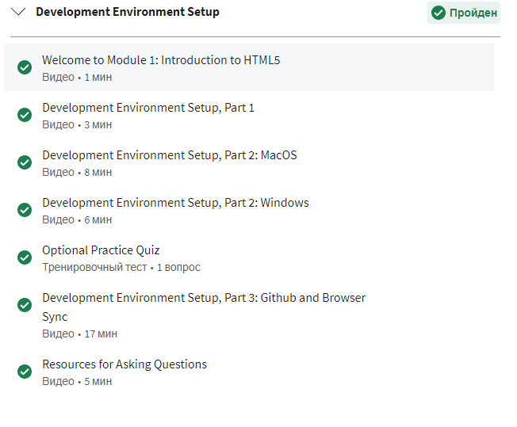
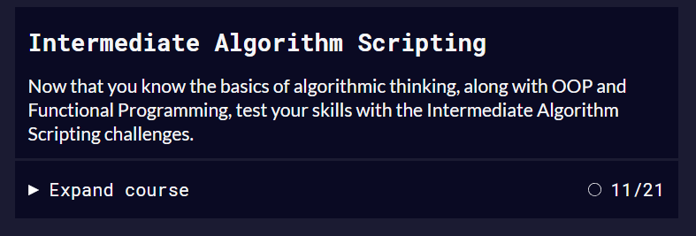

# kottans-frontend

## Linux CLI, and HTTP
Refreshed my knowledge of Linux commands and HTTP.For me, in Linux, it was new to move around other people's directories.
I was surprised that some errors may not be deleted even in the way kil -9

## Git Collaboration
Practical tasks for me were much more useful than video lessons. At first it was a little confusing, but with a little practice everything became clear) All commands are very useful and I will use them in my work in the  future.

## Intro to HTML and CSS
Refreshed my knowledge of HTML and Css. Almost everything that was in the courses I use in my practice.

## Responsive Web Design
In my practice, I use flexbox more often then Grid, for me it is a more convenient tool. Remembered the nuances of creating a Css Grid.Really liked the practice games;))))

## JS Basics
I am familiar with the Javascript language, but it is still difficult for me. I liked the practical tasks and I hope to learn how to apply this knowledge in my work))

